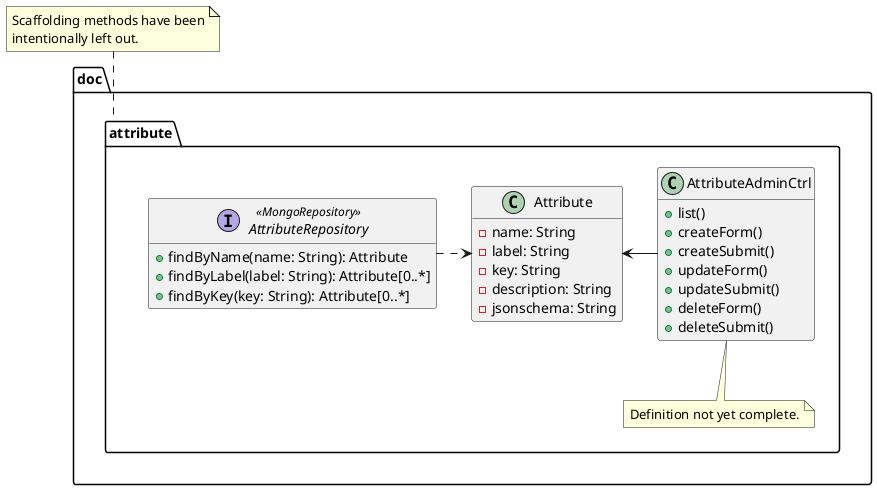

```plantuml
@startuml
package doc.attribute {
  hide empty methods
  hide empty attribute

  class Attribute {
    -name: String
    -label: String
    -key: String
    -description: String
    -jsonschema: String
  }

  AttributeRepository .> Attribute
  interface AttributeRepository <<MongoRepository>> {
    +findByName(name: String): Attribute
    +findByLabel(label: String): Attribute[0..*]
    +findByKey(key: String): Attribute[0..*]
  }

  Attribute <- AttributeAdminCtrl
  class AttributeAdminCtrl {
    +list()
    +createForm()
    +createSubmit()
    +updateForm()
    +updateSubmit()
    +deleteForm()
    +deleteSubmit()
  }
  note bottom of AttributeAdminCtrl
  Definition not yet complete.
  end note
}
note top of doc.attribute
Scaffolding methods have been
intentionally left out.
end note
@enduml
```
