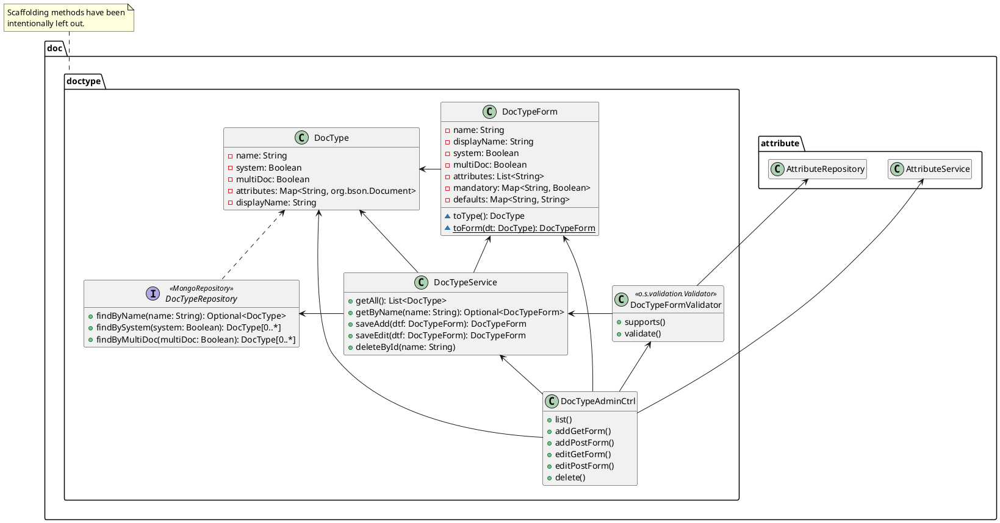

```plantuml
@startuml
package doc.attribute {
  hide empty methods
  hide empty attribute

  class AttributeRepository
  class AttributeService
}
package doc.doctype {
  hide empty methods
  hide empty attribute

  class DocType {
    -name: String
    -system: Boolean
    -multiDoc: Boolean
    -attributes: Map<String, org.bson.Document>
    -displayName: String
  }

  DocType <. DocTypeRepository
  interface DocTypeRepository <<MongoRepository>> {
    +findByName(name: String): Optional<DocType>
    +findBySystem(system: Boolean): DocType[0..*]
    +findByMultiDoc(multiDoc: Boolean): DocType[0..*]
  }

  DocTypeRepository <- DocTypeService
  DocType <-- DocTypeService
  DocTypeForm <-- DocTypeService
  class DocTypeService {
    +getAll(): List<DocType>
    +getByName(name: String): Optional<DocTypeForm>
    +saveAdd(dtf: DocTypeForm): DocTypeForm
    +saveEdit(dtf: DocTypeForm): DocTypeForm
    +deleteById(name: String)
  }

  DocType <- DocTypeForm
  class DocTypeForm {
    -name: String
    -displayName: String
    -system: Boolean
    -multiDoc: Boolean
    -attributes: List<String>
    -mandatory: Map<String, Boolean>
    -defaults: Map<String, String>
    ~toType(): DocType
    {static} ~toForm(dt: DocType): DocTypeForm
  }

  AttributeRepository <-- DocTypeFormValidator
  DocTypeService <- DocTypeFormValidator
  class DocTypeFormValidator <<o.s.validation.Validator>> {
    +supports()
    +validate()
  }

  DocType <- DocTypeAdminCtrl
  DocTypeForm <-- DocTypeAdminCtrl
  DocTypeService <-- DocTypeAdminCtrl
  DocTypeFormValidator <-- DocTypeAdminCtrl
  AttributeService <-- DocTypeAdminCtrl
  class DocTypeAdminCtrl {
    +list()
    +addGetForm()
    +addPostForm()
    +editGetForm()
    +editPostForm()
    +delete()
  }
}
note top of doc.doctype
Scaffolding methods have been
intentionally left out.
end note
@enduml
```
