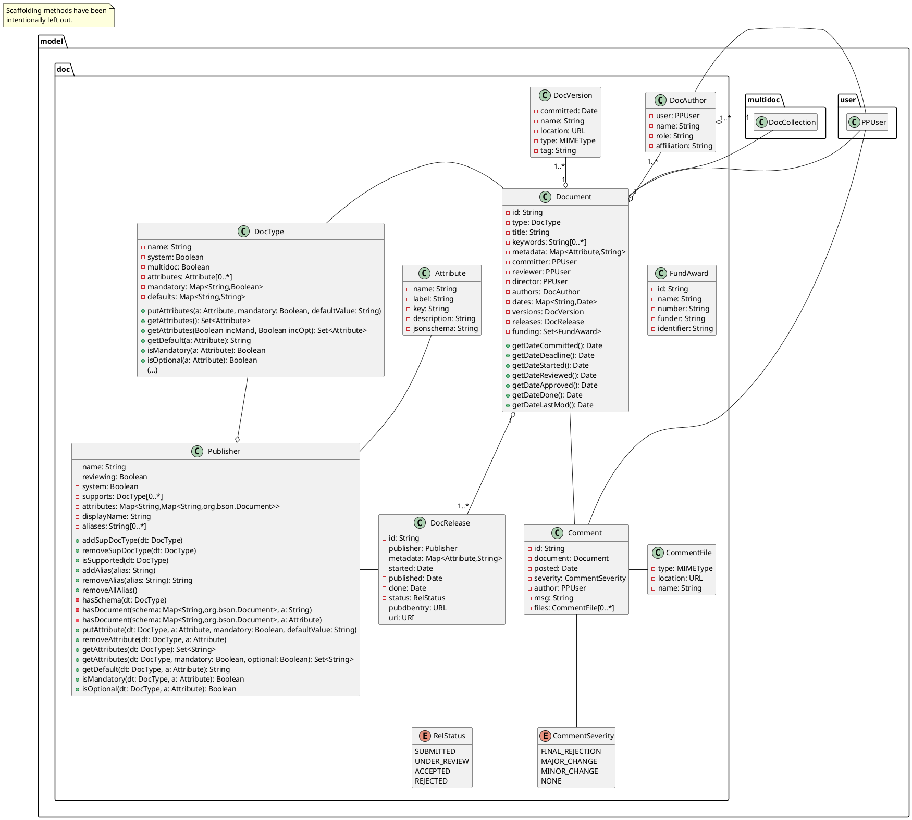

```plantuml
@startuml
package model.user {
  class PPUser
  hide members
}
package model.multidoc {
  hide members

  class DocCollection
}
package model.doc {
  hide empty methods

  PPUser --- Document
  Attribute - Document
  DocCollection -- Document
  class Document {
    -id: String
    -type: DocType
    -title: String
    -keywords: String[0..*]
    -metadata: Map<Attribute,String>
    -committer: PPUser
    -reviewer: PPUser
    -director: PPUser
    -authors: DocAuthor
    -dates: Map<String,Date>
    -versions: DocVersion
    -releases: DocRelease
    -funding: Set<FundAward>

    +getDateCommitted(): Date
    +getDateDeadline(): Date
    +getDateStarted(): Date
    +getDateReviewed(): Date
    +getDateApproved(): Date
    +getDateDone(): Date
    +getDateLastMod(): Date
  }

  DocType - Document
  Attribute - DocType
  class DocType {
    -name: String
    -system: Boolean
    -multidoc: Boolean
    -attributes: Attribute[0..*]
    -mandatory: Map<String,Boolean>
    -defaults: Map<String,String>

    +putAttributes(a: Attribute, mandatory: Boolean, defaultValue: String)
    +getAttributes(): Set<Attribute>
    +getAttributes(Boolean incMand, Boolean incOpt): Set<Attribute>
    +getDefault(a: Attribute): String
    +isMandatory(a: Attribute): Boolean
    +isOptional(a: Attribute): Boolean
    (...)
  }

  class Attribute {
    -name: String
    -label: String
    -key: String
    -description: String
    -jsonschema: String
  }

  PPUser - DocAuthor
  DocAuthor "1..*" --o "1" Document
  DocCollection "1" -o "1..*" DocAuthor
  class DocAuthor {
    -user: PPUser
    -name: String
    -role: String
    -affiliation: String
  }

  Document "1" o-- "1..*" DocRelease
  Attribute -- DocRelease
  class DocRelease {
    -id: String
    -publisher: Publisher
    -metadata: Map<Attribute,String>
    -started: Date
    -published: Date
    -done: Date
    -status: RelStatus
    -pubdbentry: URL
    -uri: URI
  }
  DocRelease -- RelStatus
  enum RelStatus {
    SUBMITTED
    UNDER_REVIEW
    ACCEPTED
    REJECTED
  }

  DocVersion "1..*" --o "1" Document
  class DocVersion {
    -committed: Date
    -name: String
    -location: URL
    -type: MIMEType
    -tag: String
  }

  Comment - PPUser
  Document -- Comment
  class Comment {
    -id: String
    -document: Document
    -posted: Date
    -severity: CommentSeverity
    -author: PPUser
    -msg: String
    -files: CommentFile[0..*]
  }
  Comment - CommentFile
  class CommentFile {
    -type: MIMEType
    -location: URL
    -name: String
  }
  Comment -- CommentSeverity
  enum CommentSeverity {
    FINAL_REJECTION
    MAJOR_CHANGE
    MINOR_CHANGE
    NONE
  }

  Publisher - DocRelease
  DocType --o Publisher
  Attribute -- Publisher
  class Publisher {
    -name: String
    -reviewing: Boolean
    -system: Boolean
    -supports: DocType[0..*]
    -attributes: Map<String,Map<String,org.bson.Document>>
    -displayName: String
    -aliases: String[0..*]

    +addSupDocType(dt: DocType)
    +removeSupDocType(dt: DocType)
    +isSupported(dt: DocType)
    +addAlias(alias: String)
    +removeAlias(alias: String): String
    +removeAllAlias()
    -hasSchema(dt: DocType)
    -hasDocument(schema: Map<String,org.bson.Document>, a: String)
    -hasDocument(schema: Map<String,org.bson.Document>, a: Attribute)
    +putAttribute(dt: DocType, a: Attribute, mandatory: Boolean, defaultValue: String)
    +removeAttribute(dt: DocType, a: Attribute)
    +getAttributes(dt: DocType): Set<String>
    +getAttributes(dt: DocType, mandatory: Boolean, optional: Boolean): Set<String>
    +getDefault(dt: DocType, a: Attribute): String
    +isMandatory(dt: DocType, a: Attribute): Boolean
    +isOptional(dt: DocType, a: Attribute): Boolean
  }

  Document - FundAward
  class FundAward {
    -id: String
    -name: String
    -number: String
    -funder: String
    -identifier: String
  }
}
note top of model.doc
Scaffolding methods have been
intentionally left out.
end note
@enduml
```
